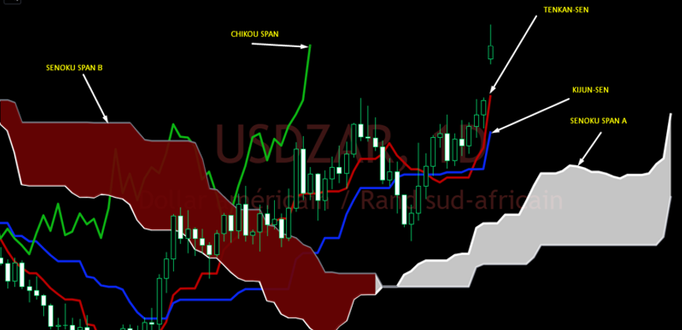
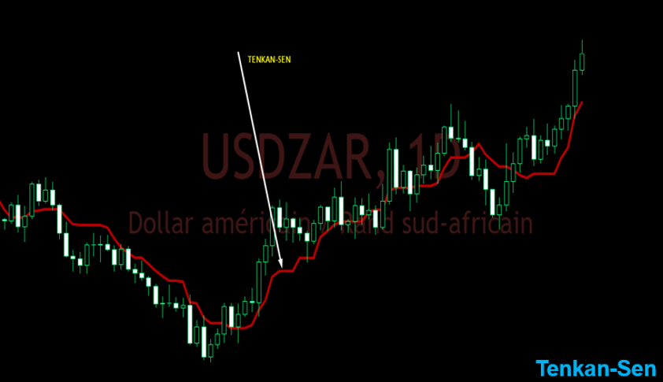
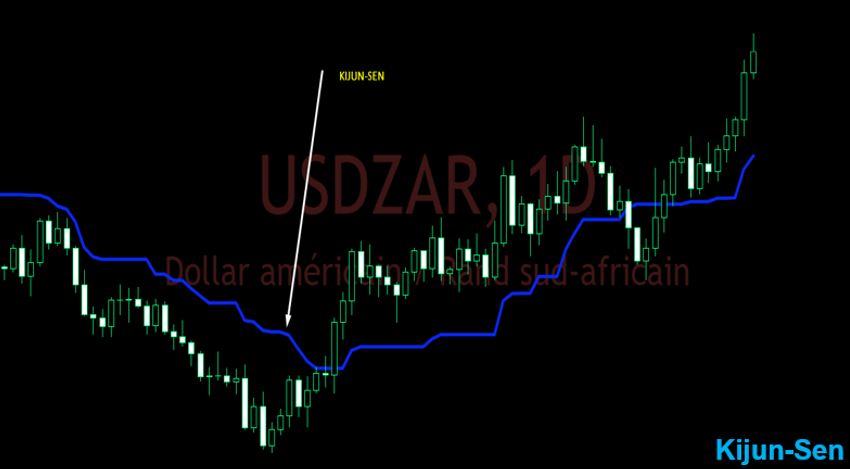
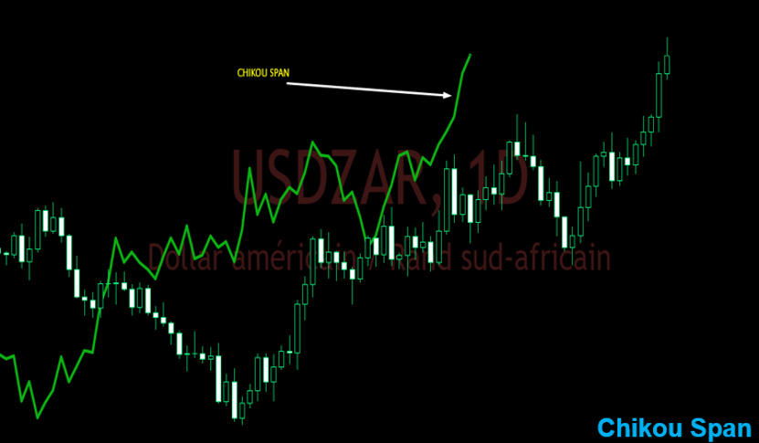
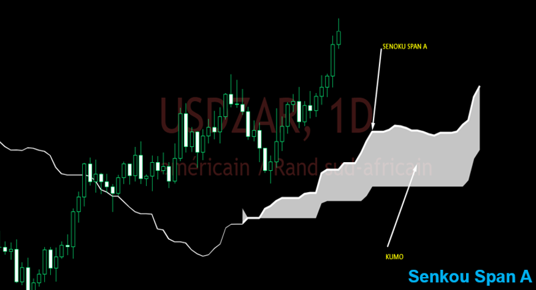
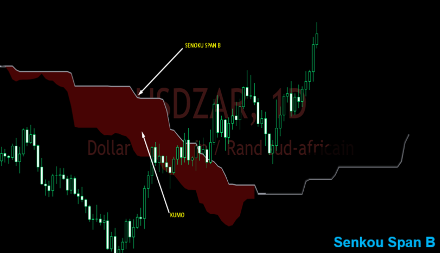

# Sinal Clássico do Ichimoku 🙏

Este botzin foi criado para **enviar o todo poderoso Sinal Clássico do Ichimoku** direto pro meu número no **Telegram**. Sem enrolação. Sinal limpo. Rápido. No momento exato.

> 💬 Este projeto nasceu de um estudo aprofundado com base no livro **_Guide complet du trading avec Ichimoku_** da **Karen Peloille** ([karenpeloille.com](https://karenpeloille.com/)), somado a **horas de análise prática com traders da França**.

---

## ⬜ Exemplo de um dos sinais clássicos de venda – Gráfico de 5 Minutos (Nasdaq 100 Cash)

  

### 🧭 Regras Básicas de Entrada e Saída

Relação de Timeframes: 5 Minutos vs 4 Horas

Nesta estratégia, o **sinal é gerado no gráfico de 5 minutos**, mas o cálculo de alguns indicadores de referência (como a **Kijun H4** e a **Tenkan H4**) é feito com base no **timeframe de 4 horas**, que representa uma janela de tempo **48 vezes maior**.

> **Em termos percentuais:**  
O timeframe de 4 horas é **4800% maior** que o de 5 minutos.

Essa abordagem permite ao robô **captar a força das tendências de médio prazo**, enquanto opera com precisão nas entradas de curto prazo.

- **Ponto de Entrada:** É quando um marubozu de venda cruza a kumo, tenkan do 4h e kijun do 4h e fecha com a chikou span livre (sem nenhum dos elementos do grafico na sua frente)

- **Stop Loss (SL):** Deve ser colocado na maxima desse movimento com uma margem de erro

- **Take Profit (TP):** O alvo é quando o preço conseguir passar da kijun e tenkan e conseguir encostar na nuvem

---

### 📊 Indicadores Usados no Setup:

- ✅ **Ichimoku Completo**  
(Com foco na leitura da Tenkan, Kijun, Chikou, Nuvem e Senkous)

- ✅ **Média Móvel Exponencial (EMA) 200**

- ✅ **Média Móvel Simples (SMA) 50**

- ✅ **Kijun H4 (Kijun de 4 Horas)**  
Calculada e sobreposta no gráfico de 5 minutos.

- ✅ **Tenkan H4 (Tenkan de 4 Horas)**  
Também sobreposta no mesmo gráfico.

---

# >_ Se quiser entender como tudo isso funciona é so estudar a materia abaixo. 👨‍💻🖥️🕵️‍♂️🔓🧪📊💡🎯

## 📈 Foco do Projeto: Nasdaq 100 Cash

O **mercado-alvo** deste projeto é o **índice Nasdaq 100 Cash**.

🔍 Todos os parâmetros da estratégia, os filtros e as condições foram **ajustados e validados** especificamente para o comportamento do **Nasdaq 100 Cash**.

---

# 🖥️ Indicador Ichimoku Kinko Hyo

## 📡 Introdução ao Sistema

No universo do **trading**, o método Ichimoku é uma referência obrigatória.

O **Ichimoku Kinko Hyo** é uma ferramenta de **análise técnica** que trabalha com os **candles japoneses**, levando em consideração **ação de preço (price action)** e **tempo** ao mesmo tempo.

📈 Desenvolvido no Japão e adotado por traders de toda a Ásia, o Ichimoku tem conquistado popularidade global entre analistas técnicos.

---

## 👤 Goichi Hosoda — O Arquiteto por trás do Ichimoku

O método **Ichimoku Kinko Hyo**, ou simplesmente **Ichimoku**, foi criado pelo **jornalista japonês Goichi Hosoda** (1898–1982), também conhecido como **“Ichimoku Sanjin”**.

🧠 Sua técnica se baseia nos **candles japoneses**, com o objetivo de realizar **previsões de alta precisão sobre as flutuações de mercado**, incorporando a dimensão do **tempo** ao processo de análise.

☑️ Goichi Hosoda buscava criar um método que sintetizasse **ação de preço + tempo + contexto de mercado**, com uma filosofia semelhante à de **William Delbert Gann**.

---

## 🧬 Origem do Nome: Ichimoku Kinko Hyo

O nome carrega o conceito central da metodologia:

| 🧩 Termo      | 🧭 Significado                |
|---------------|------------------------------|
| `Ichimoku`    | "De um só olhar"             |
| `Kinko`       | "Equilíbrio"                 |
| `Hyo`         | "Curva" / "Gráfico"          |

🎯 **Missão do método:**  
Permitir ao trader **"ver o equilíbrio do mercado em um único olhar"**, trazendo uma visão consolidada e instantânea da situação dos preços.

---

## 📚 Desenvolvimento da Metodologia Ichimoku

Para aprimorar sua técnica, **Goichi Hosoda** recrutou um grupo de estudantes que realizavam manualmente os cálculos das curvas, levando em consideração diferentes critérios matemáticos e estatísticos.

🕒 Foram necessários quase **20 anos de pesquisa** para isolar os parâmetros que hoje conhecemos como os valores padrão do sistema Ichimoku.

---

## ⚙️ Fórmulas Originais de Goichi Hosoda 📑

> Desenvolvidas após quase 20 anos de pesquisa manual com assistentes, sem computadores, na década de 1930\~1960.

| 🧪 Nome Técnico      | 🧮 Fórmula Matemática                                   | 🧭 Descrição Funcional |
|---------------------|---------------------------------------------------------|------------------------|
| **Tenkan-Sen**      | `(Máxima dos últimos 9 períodos + Mínima dos últimos 9 períodos) / 2` | **Linha de Conversão (Curto Prazo)** Indica a direção e o momentum mais recente do preço. Reage rápido. |
| **Kijun-Sen**       | `(Máxima dos últimos 26 períodos + Mínima dos últimos 26 períodos) / 2` | **Linha Base (Médio Prazo)** Serve como suporte/resistência dinâmica e filtro de tendência. |
| **Senkou Span A**   | `(Tenkan-Sen + Kijun-Sen) / 2`, projetada 26 períodos à frente | **Borda Rápida da Nuvem (Kumo Futuro)** Define uma das extremidades do Kumo. Reage mais rápido às mudanças de preço. |
| **Senkou Span B**   | `(Máxima dos últimos 52 períodos + Mínima dos últimos 52 períodos) / 2`, projetada 26 períodos à frente | **Borda Lenta da Nuvem (Suporte/Resistência de Longo Prazo)** Mais estável, define a segunda borda do Kumo. Representa o equilíbrio de longo prazo. |
| **Chikou Span**     | `Fechamento atual`, projetado 26 períodos para trás | **Linha de Atraso (Lagging Span)** Confirmação de tendência. Indica a força e o espaço livre para desenvolvimento do movimento. |

---

  

### 🧪 Detalhe Importante:

> Esses números **não foram escolhidos por acaso**!\
> Foram resultado de **décadas de backtests manuais** conduzidos por Hosoda e seus assistentes.\
> ✅ Testaram diversas combinações\
> ✅ Focaram na eficácia dos sinais\
> ✅ Validaram no mercado japonês da época

## 🕒 Por que os parâmetros 9-26-52? ⏳

| Parâmetro | Origem Histórica                                | Significado |
| --------- | ----------------------------------------------- | ----------- |
| **9**     | \~1,5 semanas de pregão no Japão dos anos 30-40 | Curto prazo |
| **26**    | \~1 mês comercial japonês                       | Médio prazo |
| **52**    | \~2 meses de pregão                             | Longo prazo |

## 🕒 Conversão dos Períodos Originais do Ichimoku para o Horário da Nasdaq

O Ichimoku foi desenvolvido com base no mercado japonês dos anos 30–40, considerando a duração dos pregões da época.  
Abaixo está a adaptação para o contexto da **Nasdaq**, considerando o **horário regular de negociação** e também uma estimativa para quem quiser usar **pré-market + after-hours (extensão 24h aprox)**.

---

| 📏 Componente       | 🗓️ Equivalente em Dias Úteis (Nasdaq) | ⏱️ Horas de Pregão Regular (6,5h/dia) | ⏲️ Horas Estendidas (Pré + After + Regular ~16h/dia) |
|--------------------|----------------------------------------|--------------------------------------|------------------------------------------------------|
| **Tenkan‑Sen (9)** | 9 dias úteis                           | 58,5 horas                           | 144 horas                                            |
| **Kijun‑Sen (26)** | 26 dias úteis                          | 169 horas                            | 416 horas                                            |
| **Senkou Span B (52)** | 52 dias úteis                      | 338 horas                            | 832 horas                                            |

### 🎯 Por que manter os parâmetros originais?

> muitos traders profissionais ao redor do mundo **preferem manter os valores clássicos (9-26-52)**, pois assim estão **em sintonia com a maioria dos players globais que operam Ichimoku**.

---

# Agora vamos ver sobre cada componente sagrado do ichimokU 🙏 começando pela tenkanzinha:

## 🟥 Tenkan-Sen (転換線) – A Linha de Conversão

A **Tenkan-Sen** representa o **equilíbrio de curto prazo** do preço, também chamada de **Tenkan**, é calculada da mesma forma que a **Kijun-Sen**, mas usando apenas as **9 últimas velas (períodos)**.

### 🧮 Cálculo

A **Tenkan-Sen**, também chamada de **Tenkan**, é calculada da mesma forma que a **Kijun-Sen**, mas usando apenas as **9 últimas velas (períodos)**.

➡️ Pode ser vista como uma **"Kijun rápida"**.  
➡️ Sua periodicidade é cerca de **3 vezes menor** que a da Kijun.  
➡️ Utilizada como **linha de sinal**.

---

  

---
## 🟦 Kijun-Sen (基準線) – A Linha Base

A **Kijun-Sen** atua como uma **linha de equilíbrio**, podendo servir como **suporte** ou **resistência**.

### 🧮 Cálculo

A **Kijun-Sen**, ou simplesmente **Kijun**, é um **indicador de direção da tendência**.

Ela corresponde à **média entre o menor preço e o maior preço das últimas 26 velas (períodos)**.

➡️ Esta curva **indica a futura direção do preço**.  
➡️ Pode ser utilizada **sozinha** para tomada de decisão de **compra ou venda**.  
➡️ Representa o **equilíbrio de médio prazo**.

---

### 🎯 Função Principal

| Situação | Significado |
|--------|--------|
| 📈 Preço acima da Kijun | Provável **tendência de alta** |
| 📉 Preço abaixo da Kijun | Provável **tendência de baixa** |

---

  

---

## 🟩 Chikou Span (遅行スパン) – Linha de Retardo (Lagging Span)

### 📌 O que é?

A **Chikou Span**, ou apenas **Chikou**, é o **indicador do último preço de fechamento**, projetado **26 períodos para trás**.

➡️ Para traçar a Chikou, basta **voltar 26 períodos no gráfico** e marcar o preço de fechamento correspondente.  
➡️ Também é chamada de **linha de preços deslocados** ou **"Lagging Span"**.

---

### 🎯 Função Principal

A **Chikou Span** é frequentemente utilizada pelos traders para **confirmar ou invalidar uma entrada em posição**.

| Situação | Significado |
|--------|--------|
| 📉 Chikou abaixo dos preços | **Evitar compras**, sinaliza venda ou fraqueza |
| 📈 Chikou acima dos preços | **Sinal de compra**, indica força de alta |

As interpretações podem variar de acordo com o contexto, mas de forma geral:

- ❌ Não se deve comprar se a Chikou estiver **abaixo dos preços**.
- ✅ Se a Chikou atravessa os preços de **baixo para cima**, é um sinal de **compra**.

---

  

## ⬜ Senkou Span A (先行スパン1) – Primeira Linha do Nuvem (Leading Span 1)

### 📌 O que é?

Frequentemente abreviada como **SSA**, a **Senkou Span A** é a **primeira linha que forma a nuvem (Kumo)**.

➡️ Ela corresponde à **média entre a Kijun-Sen e a Tenkan-Sen**, projetada **26 períodos à frente** no gráfico.

---

### 🎯 Função Principal

A **Senkou Span A** forma a **borda do Kumo (nuvem)** e também é chamada de **Leading Span 1**.

De forma geral:

| Situação | Significado |
|--------|--------|
| 📈 Preço acima da nuvem | A **Senkou Span A** atua como **suporte** |
| 📉 Preço abaixo da nuvem | Atua como **resistência** |

**Essa curva permite determinar o nível de risco**, oferecendo assim a possibilidade de **antecipar uma compra ou uma venda**.

---

  

## ⬜ Senkou Span B (先行スパン2) – Segunda Linha da Nuvem (Leading Span 2)

### 📌 O que é?

A **Senkou Span B**, também chamada de **SSB**, é o **segundo contorno da nuvem Kumo**.

➡️ Ela corresponde à **média entre o menor preço e o maior preço das últimas 52 velas (períodos)**, projetada **26 períodos à frente** no gráfico.

➡️ Pode ser vista como uma **Kijun deslocada para frente**, calculada com base nas **52 últimas velas**.

---

### 🎯 Função Principal

A **Senkou Span B** também é chamada de **Leading Span 2** e forma a **outra borda do Kumo**.

Assim como a **Senkou Span A**, ela **ajuda a determinar o nível de risco**.

| Situação | Significado |
|--------|--------|
| 📉 Preço abaixo da Senkou Span B | Atua como **resistência** |
| 📈 Preço acima da Senkou Span B | Atua como **suporte** |

---

  

## ⬜ Kumo (雲) – A Nuvem

### 📌 O que é?

O **Kumo**, ou simplesmente **nuvem**, é o **espaço entre a Senkou Span A e a Senkou Span B**, independentemente das posições relativas dessas duas curvas.

➡️ A **espessura** e a **forma** da nuvem servem como **indicadores das flutuações de preço**.

De maneira geral:

- **Quanto mais espessa a nuvem**, **maior a volatilidade do mercado**.
- A **posição** das linhas A e B, bem como a **orientação da nuvem**, também servem como indicadores.

---

### 🎯 Função Principal

| Situação | Significado |
|--------|--------|
| 📉 Tendência de baixa | Quando a **Senkou Span B está acima da Senkou Span A** |
| 📈 Tendência de alta | Quando a **Senkou Span A está acima da Senkou Span B** |

O **ângulo da nuvem** também indica se o movimento é **ascendente** ou **descendente**.

Além disso, a **posição atual dos preços em relação à nuvem** é fundamental na interpretação:

- Se o preço estiver **acima do Kumo**, a nuvem atua como **suporte**.
- Se o preço estiver **abaixo do Kumo**, a nuvem funciona como **resistência**.

---

  

## ⬜ Sinais de Compra e Venda no Ichimoku

> O Ichimoku vai muito além de apenas cruzamentos.  
> Um bom sinal de compra, por exemplo, **não é apenas o cruzamento da Tenkan com a Kijun**, mas também deve estar **acima da nuvem**, com a **Chikou Span validando** e preferencialmente com **uma nuvem futura apontando para cima**.

Da mesma forma, um sinal de venda só será considerado forte se:

- O cruzamento for de baixa
- O preço estiver abaixo da nuvem
- A Chikou também estiver abaixo dos preços
- A nuvem futura estiver apontando para baixo

---
